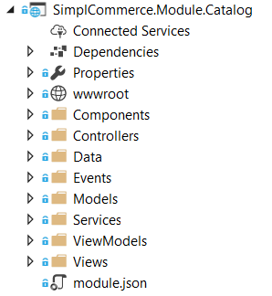

# Internal structure of a module

---

The structure of a module is very straightforward. We just want to highlight some important notes below:

- The **Data** folder is where we put custom repositories or custom entity framework mappings. Normally we use the generic Repository<ModelName> instead of creating repositories for every models. In the case we need more method than what the generic repository provide, we will create a repository for it. If you wish to do some custom mapping for your model, create an implementation of ICustomModelBuilder, which will automatically hooked during the startup.

- The **Events** folder is where we put domain event handling code. We use MediatR for publishing and handling domain events such as UserSignedIn, EntityViewed, EntityDeleting. You can publish your own events and handle them.

- The **wwwroot** folder is where we put the front-end code. 

- The **Services** folder is where we put the business logic code. For simple scenarios select, insert, update, delete. We recommend that you call repository directly in Controllers, instead of creating services just a wrapping of Repositories.

- All the IoC registrations for each modules are need to register explicitly in ModuleInitializer

- Checkout my post on how to manage dependency on modules [Plug-in architecture on ASP.NET Core - Dependency problems and solutions](https://thienn.com/plug-in-architecture-on-aspnetcore-dependency-problems-solutions)
